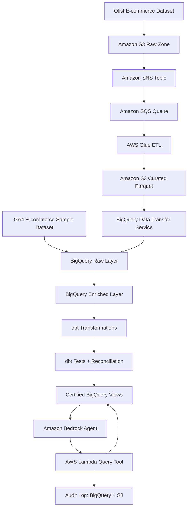

# Hybrid Cloud Governed AI Commerce Analyst

**AWS Event-Driven Ingestion + BigQuery Medallion Architecture + dbt Governance + Amazon Bedrock AI Analyst Agent**

This project demonstrates a hybrid cloud commerce analytics platform where AWS handles ingestion, event routing, ETL orchestration, and AI-agent execution, while BigQuery acts as the analytical warehouse. dbt creates governed transformation models, reconciliation logic, tests, documentation, and certified views that the AI analyst agent is allowed to query.

## Target architecture



## Why this project exists

An AI data analyst should not query raw data directly. It should answer business questions only from certified, tested, reconciled, and access-controlled analytics views.

This project shows how to build that architecture using:

- **AWS S3** for landing and curated storage.
- **SNS/SQS** for event notification and reliable asynchronous processing.
- **AWS Glue** for ETL and Parquet conversion.
- **BigQuery Data Transfer Service** for S3-to-BigQuery loading.
- **BigQuery** for raw, enriched, mart, governed, and audit datasets.
- **dbt** for transformation, testing, documentation, and reconciliation.
- **Amazon Bedrock Agent + Lambda** for the governed AI analyst interface.
- **Audit logging** for question, SQL, tables used, role, decision, and answer.

## Datasets

| Dataset | Purpose |
|---|---|
| GA4 E-commerce Sample Dataset | Customer journey analytics, funnel analysis, product engagement, traffic performance |
| Olist Brazilian E-commerce Dataset | Orders, payments, freight, delivery, seller performance, reconciliation |

## Repository structure

```text
.
├── app/agent/                         # AI-agent backend helpers
├── dbt/commerce_analytics/            # dbt project for BigQuery models/tests/docs
├── docs/                              # Architecture, ADRs, data dictionary
├── infra/terraform/aws/               # AWS starter infrastructure
├── infra/terraform/gcp/               # BigQuery starter infrastructure
├── scripts/                           # Local helper scripts
├── src/glue/                          # AWS Glue ETL scripts
├── src/lambda/                        # Lambda handler used by Bedrock action group
├── .env.example
├── .gitignore
└── requirements.txt
```

## MVP phases

### Phase 1 — Create the cloud foundation

Create AWS resources:

- S3 raw bucket
- S3 curated bucket
- S3 audit bucket
- SNS topic
- SQS queue
- Dead-letter queue

Create GCP resources:

- BigQuery datasets:
  - `commerce_raw`
  - `commerce_enriched`
  - `commerce_dbt_marts`
  - `commerce_governed`
  - `commerce_audit`

### Phase 2 — Ingest Olist through AWS

```text
Olist CSV files
   ↓
S3 raw bucket
   ↓
SNS event
   ↓
SQS processing queue
   ↓
Glue ETL
   ↓
S3 curated Parquet
   ↓
BigQuery Data Transfer Service
   ↓
BigQuery raw tables
```

### Phase 3 — Add GA4 customer journey data

Use the GA4 e-commerce sample dataset as the event analytics source. For a portfolio-friendly version, load a limited date range into your own BigQuery `commerce_raw` dataset.

### Phase 4 — Build dbt models

```text
commerce_raw
   ↓
staging models
   ↓
intermediate models
   ↓
facts and dimensions
   ↓
reconciliation marts
   ↓
certified governed views
```

### Phase 5 — Build the AI analyst agent

The agent should only query `commerce_governed` views, never `commerce_raw` or unrestricted enriched tables.

Example safe questions:

- Which product categories have the highest revenue?
- Which sellers have the most delivery SLA issues?
- Which orders have payment reconciliation mismatches?
- Which customer journey stages have the highest drop-off?

## Local setup

```bash
python -m venv .venv
source .venv/bin/activate
pip install -r requirements.txt
cp .env.example .env
```

## dbt setup

```bash
cd dbt/commerce_analytics
pip install dbt-bigquery
dbt debug
dbt deps
dbt build
```

## Security rules

- Do not commit service account keys.
- Do not commit AWS access keys.
- Use AWS IAM roles where possible.
- For production, prefer Workload Identity Federation between AWS and GCP instead of long-lived GCP service account keys.
- The AI agent service should have access only to certified BigQuery views.
- Every generated SQL query must be validated before execution.
- Every question, SQL query, data source, and answer must be logged.

## Core design decision

Dataform is a valid GCP-native BigQuery transformation tool. This project uses dbt because the goal is to demonstrate governed analytics engineering: modular models, tests, documentation, reconciliation, CI/CD-friendly workflows, and a controlled semantic layer before exposing data to an AI analyst agent.
